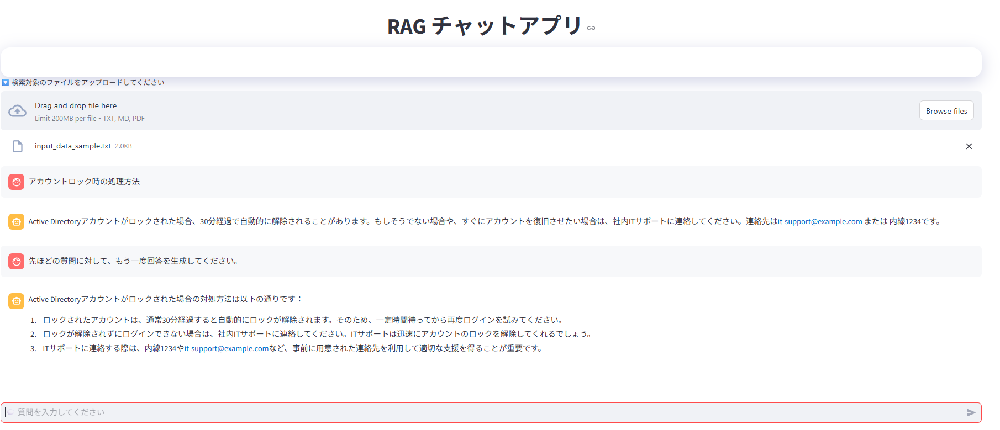

#  RAG チャットアプリ

このアプリは、アップロードされたテキストファイル（`.txt`, `.md`, `.pdf`）を元に、OpenAI の API を使って質問応答を行う **RAG (Retrieval-Augmented Generation)** アプリです。  
Streamlit を使って開発されており、**チャット形式のインターフェース**でやり取り可能です。

---

##  特徴

-  ファイルアップロードによる独自データでの質問応答
-  LangChain + OpenAI による RAG 構成
-  会話形式のチャットUI
-  ソースとなった文書の確認機能付き

---

##  必要要件

- OpenAI API キー（`.env` に設定）

---

##  インストール手順

1. **リポジトリをクローン**

   ```bash
   git clone https://github.com/masakiEngineer/web-app-rag.git
   cd web-app-rag

2. **ライブラリのインストール**

   ```bash
   pip install -r requirements.txt

3. **アプリ起動**

   ```bash
   streamlit run app.py

##  アプリ実行結果

